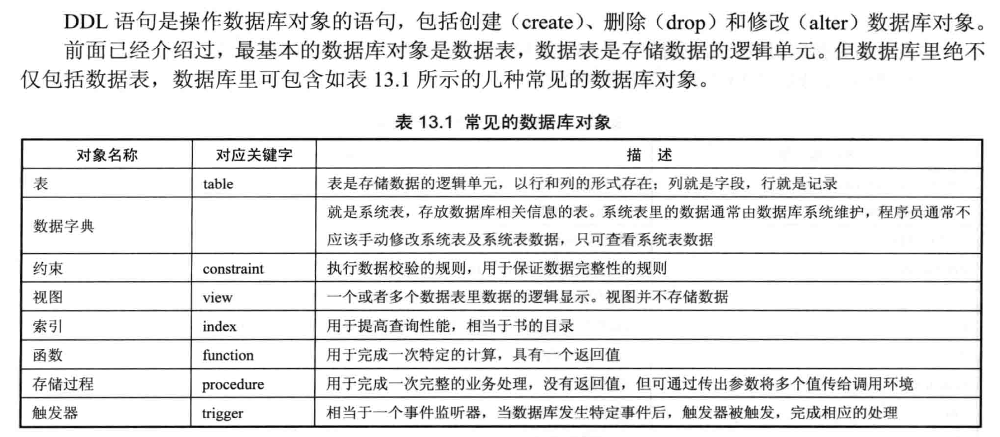
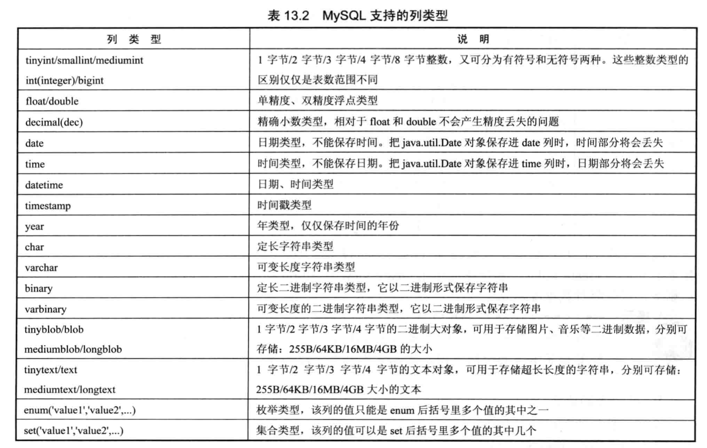

# gitbook-daliu-mysql
mysql学习记录

SQL语句分类(SQL语句不区分大小写)：
1. DML（Data Manipulation Language，数据操作语言）比如：insert  update  delete
2. DDL (Data Definition Language, 数据定义语言) 比如：create  alter  drop  truncate
3. DCL (Data Control Language， 数据控制语言，为数据库用户授权) 比如：grant  revoke
4. 事务控制：比如：commit  rollback  savepoint




MySQL数据库的一个实例(Server Instance)可以同时包含多个数据库，查看当前实例下包含的数据库：

```
show databases;
```

SQL关键字不区分大小写，create和CREATE同义，但标识符区分。标识符可用于定义表名、列名、也可用于定义变量。标识符必须以字符开头，可包含字母、数字和三个特殊字符(# _ $)， 建议以`_`连接多个单词。

```java
mysql> mysql -u [username] -p  // 然后输入密码
mysql> create database [IF NOT EXISTS] 数据库名; // 创建数据库
mysql> drop database 数据库名; // 删除数据库
mysql> use 数据库名; // 进入指定数据库
mysql> show tables; // 查看当前数据库下多少个表格
mysql> desc 表名; // 查看表结构
```

### MAC配置

MAC 配置环境变量：

```sh
vim ~/.bash_profile

export PATH=$PATH:/usr/local/mysql-8.0.17-macos10.14-x86_64/bin

alias mysql=/usr/local/mysql-8.0.17-macos10.14-x86_64/bin/mysql
```

```
# 让配置文件生效
source ~/.bash_profile
```

```
# 启动mysql
mysql -u root -p
da*****
```

### Mac OS zsh: command not found

参见： [https://blog.csdn.net/Wjhsmart/article/details/85322226](https://blog.csdn.net/Wjhsmart/article/details/85322226)  

```
vim ~/.bash_profile
alias mysql=/usr/local/mysql/bin/mysql

source ~/.bash_profile
```

如果是zsh环境： 

```
vim ~/.bashrc
alias mysql=/usr/local/mysql/bin/mysql

source ~/.bashrc
```
