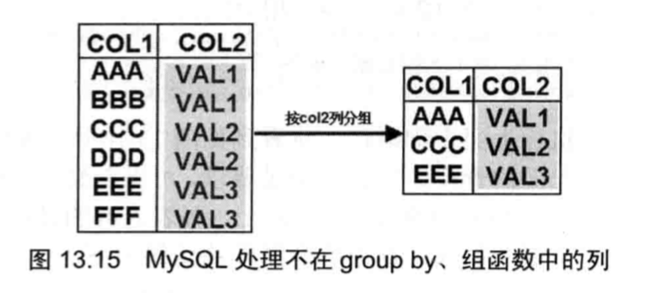

# 函数

每个数据库都会在标准的SQL基础上扩展一些函数，MySQL也不例外。
函数可以出现在SQL语句的各个位置，常见于select和where子句中。

数据库函数按种类可分为单行函数和多行函数，单行函数对每行输入单独计算，每行得到一个计算结果；多行函数对多行输入整体计算，最后只会得到一个结果。

### 单行函数

一些单行函数示例：

```sql
mysql> select * from student;
+----+-----------+-------+------+-----------+
| id | name      | score | age  | sdept     |
+----+-----------+-------+------+-----------+
| 1  | 刘威振    |   100 |   10 | 化学系    |
| 2  | 张三丰    |    99 |   10 | 化学系    |
| 3  | 王五      |    88 |   10 | 化学系    |
+----+-----------+-------+------+-----------+

mysql> select char_length(name) from student;
+-------------------+
| char_length(name) |
+-------------------+
|                 3 |
|                 3 |
|                 2 |
+-------------------+

mysql> select sin(char_length(name)) from student;
mysql> select sin(1.56);
mysql> select date_add('1998-01-02', interval 2 month); # 也可以DATE_ADD
+------------------------------------------+
| date_add('1998-01-02', interval 2 month) |
+------------------------------------------+
| 1998-03-02                               |
+------------------------------------------+

mysql> select adddate('1998-01-02', 3); # 也可以ADDDATE
+--------------------------+
| adddate('1998-01-02', 3) |
+--------------------------+
| 1998-01-05               |
+--------------------------+

mysql> select curDate(); # 函数不分大小写，curDate() curdate() CURDATE()都是一样的

mysql> select curTime();

mysql> select md5('hello');

mysql> select * from student;
+----+-----------+-------+------+--------------+
| id | name      | score | age  | sdept        |
+----+-----------+-------+------+--------------+
| 1  | 刘威振    |   100 |   10 | 化学系       |
| 2  | 张三丰    |    99 |   10 | 化学系       |
| 3  | 王五      |    88 |   10 | 化学系       |
| 4  | NULL      |   100 |   20 | 计算机系     |
+----+-----------+-------+------+--------------+


# 如果name为空，则返回'没有名字'
mysql> select ifnull(name, '没有名字') from student;
+------------------------------+
| ifnull(name, '没有名字')     |
+------------------------------+
| 刘威振                       |
| 张三丰                       |
| 王五                         |
| 没有名字                     |
+------------------------------+

# 如果name等于'张三丰'，返回null
# 注：如果name是null, 则nullif(null, '张三丰')也是返回null
mysql> select nullif(name, '张三丰') from student;
+---------------------------+
| nullif(name, '张三丰')    |
+---------------------------+
| 刘威振                    |
| NULL                      |
| 王五                      |
| NULL                      |
+---------------------------+
```

**case-when**

```sql
mysql> select name, case id
    -> when 1 then 'Java'
    -> when 2 then 'C++'
    -> when 3 then 'OC'
    -> else '其他语言'
    -> end
    -> from student;
    
mysql> select name, case
    -> when id<=1 then '初级班'
    -> when id<=3 then '中级班'
    -> else '高级班'
    -> end
    -> from student;
```

### 分组和组函数

- avg(...)
- count(...)
- max(...)
- min(...)
- sum(...)
... 

```sql
mysql> select count(*) from student;
mysql> select count(distinct score) from student;
mysql> select sum(score) from student;
mysql> select sum(20) from student; # 20乘以记录数
mysql> select sum(distinct 20) from student; # 因为sum里的expr是常量20，所以每行的值都相同，即都是20，但由于使用distinct强制不计算重复值，所以结果为20
mysql> select max(id) from student;
mysql> select min(score) from student;
mysql> select count(name) from student;
mysql> select avg(ifnull(score, 0)) from student;
# mysql> select count (distinct *) from student; # 语法错误，distinct和*不能同时使用
```

默认情况下，组函数会把所有记录当成一组，为了地记录进行显式分组，可以在select语句后使用group by子句:

```sql
mysql> select * from student;
+----+-----------+-------+------+--------------+
| id | name      | score | age  | sdept        |
+----+-----------+-------+------+--------------+
| 1  | 刘威振    |   100 |   10 | 化学系       |
| 2  | 张三丰    |    99 |   10 | 化学系       |
| 3  | 王五      |    88 |   10 | 化学系       |
| 4  | NULL      |   100 |   20 | 计算机系     |
+----+-----------+-------+------+--------------+

# count(*)将会对每组得到一个结果
mysql> select count(*)
    -> from student
    -> # 将score列值相同的记录当成一组
    -> group by score;
+----------+
| count(*) |
+----------+
|        2 |
|        1 |
|        1 |
+----------+
```

如果对多列进行分组，则要求多列的值完全相同才会被当成一组。

```
mysql> SELECT * FROM student;
+----+-----------+-----------+-------+------------+
| id | name      | sdept     | score | class      |
+----+-----------+-----------+-------+------------+
|  1 | 李小龙    | 历史系    |    99 | 高一       |
|  2 | 李小龙    | 地理系    |    99 | 高一7班    |
|  3 | 刘德华    | 数学系    |    90 | 高一5班    |
|  4 | 刘德华    | 历史系    |    98 | 高一7班    |
|  5 | 刘方振    | 物理系    |   100 | 高一2班    |
|  6 | 李连杰    | 外语系    |    69 | 高一8班    |
|  7 | 张三丰    | 文学系    |    77 | 高一4班    |
|  8 | 成龙      | 历史系    |    88 | 高一7班    |
+----+-----------+-----------+-------+------------+

mysql> select count(*) from student group by name, score;
+----------+
| count(*) |
+----------+
|        2 |
|        1 |
|        1 |
|        1 |
|        1 |
|        1 |
|        1 |
+----------+

mysql> select name, count(*) from student group by name, score;
+-----------+----------+
| name      | count(*) |
+-----------+----------+
| 李小龙    |        2 |
| 刘德华    |        1 |
| 刘德华    |        1 |
| 刘方振    |        1 |
| 李连杰    |        1 |
| 张三丰    |        1 |
| 成龙      |        1 |
+-----------+----------+
```

对于许多数据库而言，分组计算时有严格的规则----如果查询列表或select语句中使用了group by分组，则要求出现在select列表中的字段，要么使用组函数包起来，要么必须出现在group by子句中。这条规则很容易理解，因为一旦使用了组函数或group by子句，都将导致多条记录只有一条输出，系统无法确定输出多条记录中的哪一条记录。
对于MySQL来说，并没有这个规则，如果某个列既没有出现在group by之后，也没有使用组函数包起来，则MySQL会输出该列的第一条记录，如下图所示：

```sql
SELECT COL1 from student GROUP BY COL2;
```



但是，在MySQL 5.7以后，MySQL默认的sql配置是：`sql_mode="ONLY_FULL_GROUP_BY"`, 这个配置严格执行了"SQL92标准"。这会导致执行上面的SQL语句出现错误：
... this is incompatible with sql_mode=only_full_group_by。

由于开启了ONLY_FULL_GROUP_BY的设置，所以如果一个字段没有在target list(紧跟select的列)和group by字段中同时出现，或者是聚合函数的值的话，那么这条sql查询是被mysql认为非法的，会报错误。

如果需要对分组进行过滤，应使用having子句（where仅用于行，不用于组）, having子句后面也是一个条件表达式，只有满足该条件表达式的分组才会被选出来。

```sql
mysql> select * from student group by score having count(*) > 2;
```

**集合运算--交并差**

select语句查询的结果是一个包含多条数据的结果集，类似于数学里的集合，可以进行交(intersect)， 并(union)和差(minus)运算，使用这些集合运算要求参与运算的两个结果集满足如下条件：

- 列数量相等
- 列数据类型一一对应相同

```sql
mysql> select * from student;
+----+-----------+-----------+-------+------------+------------+
| id | name      | sdept     | score | class      | teacher_id |
+----+-----------+-----------+-------+------------+------------+
|  2 | 李小龙    | 地理系    |    99 | 高一7班    | 1          |
|  4 | 刘德华    | 历史系    |    98 | 高一7班    | 1          |
|  5 | 刘方振    | 物理系    |   100 | 高一2班    | 2          |
|  6 | 李连杰    | 外语系    |    69 | 高一8班    | 2          |
|  7 | 张三丰    | 文学系    |    77 | 高一4班    | 2          |
|  8 | 成龙      | 历史系    |    88 | 高一7班    | 2          |
+----+-----------+-----------+-------+------------+------------+

mysql> select * from teacher;
+------+-----------+
| id   | name      |
+------+-----------+
|    1 | Yeeku     |
|    2 | LeeBruse  |
|    3 | 刘德华    |
|    4 | 刘德华    |
+------+-----------+

# union示例
mysql> select * from teacher
    -> union
    -> select id, name from student;
+------+-----------+
| id   | name      |
+------+-----------+
|    1 | Yeeku     |
|    2 | LeeBruse  |
|    3 | 刘德华    |
|    4 | 刘德华    |
|    2 | 李小龙    |
|    5 | 刘方振    |
|    6 | 李连杰    |
|    7 | 张三丰    |
|    8 | 成龙      |
+------+-----------+

# minus示例
# 选取学生表中所有学生减去与老师id相同，姓名相同的记录
mysql> select * from student
    -> minus
    -> select id, name from teacher;
# MySQL不支持minus. 只能借助于子查询“曲线”实现minus运算：
mysql> select * from student 
    -> where(id, name)
    -> not in
    -> (select id, name from teacher);
    
# intersect示例
# 选取学生记录中与老师记录中的id相同、姓名相同的记录
mysql> select id, name from student
    -> intersect
    -> select id, name from teacher;
# MySQL不支持intersect，只能借助于子查询“曲线”实现intersect运算：
mysql> select id, name from student
    -> where
    -> (id, name) in
    -> (select id, name from teacher);
# 也可以使用join-on：
mysql> select s.id, s.name from student s
    -> join teacher t
    -> on (s.id = t.id and s.name = t.name);
# 选取学生记录中与老师记录中的id相同、姓名相同的记录
# 并且id<6, 姓名以刘开头
mysql> select s.id, s.name from student s
    -> join teacher t
    -> on(s.id=t.id and s.name=t.name)
    -> where s.id<6 and t.name like '刘%';
```


