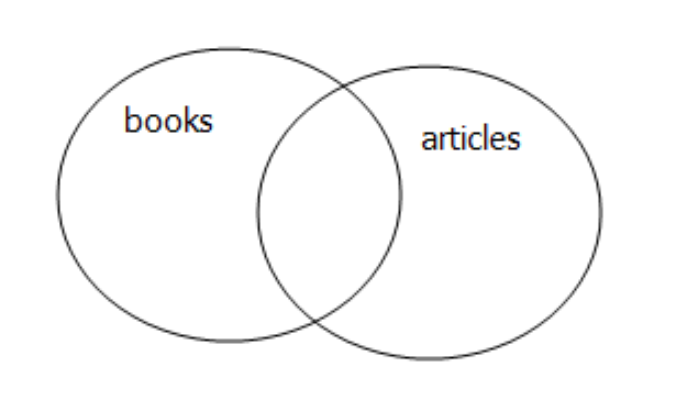
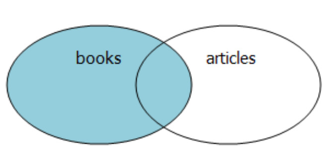
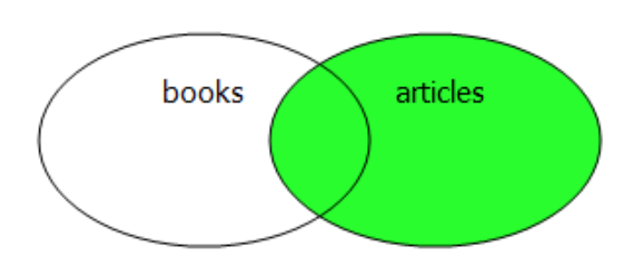

# 连接查询

多表连接查询：

- 等值连接
- 非等值连接
- 外连接
- 广义笛卡儿积
- 自然连接
- 交叉连接
- 使用using子句连接
- 使用on子句连接
- 全外连接，左、右外连接

**等值连接**

```sql
mysql> select * from student;
+----+-----------+-----------+-------+------------+------------+
| id | name      | sdept     | score | class      | teacher_id |
+----+-----------+-----------+-------+------------+------------+
|  1 | 李小龙    | 历史系    |    99 | 高一       | 1          |
|  2 | 李小龙    | 地理系    |    99 | 高一7班    | 1          |
|  3 | 刘德华    | 数学系    |    90 | 高一5班    | 1          |
|  4 | 刘德华    | 历史系    |    98 | 高一7班    | 1          |
|  5 | 刘方振    | 物理系    |   100 | 高一2班    | 2          |
|  6 | 李连杰    | 外语系    |    69 | 高一8班    | 2          |
|  7 | 张三丰    | 文学系    |    77 | 高一4班    | 2          |
|  8 | 成龙      | 历史系    |    88 | 高一7班    | 2          |
+----+-----------+-----------+-------+------------+------------+

mysql> select * from teacher;
+------+----------+
| id   | name     |
+------+----------+
|    1 | Yeeku    |
|    2 | LeeBruse |
+------+----------+

# 查询所有学生资料及对应的老师姓名
mysql> select s.*, t.name as teacher_name from
    -> student s, teacher t
    -> where s.teacher_id=t.id;
```

**笛卡儿积**

```sql
mysql> select * from student;

+----+-----------+-----------+-------+------------+------------+--------------+
| id | name      | sdept     | score | class      | teacher_id | teacher_name |
+----+-----------+-----------+-------+------------+------------+--------------+
|  1 | 李小龙    | 历史系    |    99 | 高一       | 1          | Yeeku        |
|  2 | 李小龙    | 地理系    |    99 | 高一7班    | 1          | Yeeku        |
|  3 | 刘德华    | 数学系    |    90 | 高一5班    | 1          | Yeeku        |
|  4 | 刘德华    | 历史系    |    98 | 高一7班    | 1          | Yeeku        |
|  5 | 刘方振    | 物理系    |   100 | 高一2班    | 2          | LeeBruse     |
|  6 | 李连杰    | 外语系    |    69 | 高一8班    | 2          | LeeBruse     |
|  7 | 张三丰    | 文学系    |    77 | 高一4班    | 2          | LeeBruse     |
|  8 | 成龙      | 历史系    |    88 | 高一7班    | 2          | LeeBruse     |
+----+-----------+-----------+-------+------------+------------+--------------+

mysql> select * from teacher;
+------+----------+
| id   | name     |
+------+----------+
|    1 | Yeeku    |
|    2 | LeeBruse |
+------+----------+

# 没有where语句即笛尔儿积，笛尔儿积会产生n*m行记录：
mysql> select s.*, t.name as teacher_name
    -> from student s, teacher t;
+----+-----------+-----------+-------+------------+------------+--------------+
| id | name      | sdept     | score | class      | teacher_id | teacher_name |
+----+-----------+-----------+-------+------------+------------+--------------+
|  1 | 李小龙    | 历史系    |    99 | 高一       | 1          | Yeeku        |
|  1 | 李小龙    | 历史系    |    99 | 高一       | 1          | LeeBruse     |
|  2 | 李小龙    | 地理系    |    99 | 高一7班    | 1          | Yeeku        |
|  2 | 李小龙    | 地理系    |    99 | 高一7班    | 1          | LeeBruse     |
|  3 | 刘德华    | 数学系    |    90 | 高一5班    | 1          | Yeeku        |
|  3 | 刘德华    | 数学系    |    90 | 高一5班    | 1          | LeeBruse     |
|  4 | 刘德华    | 历史系    |    98 | 高一7班    | 1          | Yeeku        |
|  4 | 刘德华    | 历史系    |    98 | 高一7班    | 1          | LeeBruse     |
|  5 | 刘方振    | 物理系    |   100 | 高一2班    | 2          | Yeeku        |
|  5 | 刘方振    | 物理系    |   100 | 高一2班    | 2          | LeeBruse     |
|  6 | 李连杰    | 外语系    |    69 | 高一8班    | 2          | Yeeku        |
|  6 | 李连杰    | 外语系    |    69 | 高一8班    | 2          | LeeBruse     |
|  7 | 张三丰    | 文学系    |    77 | 高一4班    | 2          | Yeeku        |
|  7 | 张三丰    | 文学系    |    77 | 高一4班    | 2          | LeeBruse     |
|  8 | 成龙      | 历史系    |    88 | 高一7班    | 2          | Yeeku        |
|  8 | 成龙      | 历史系    |    88 | 高一7班    | 2          | LeeBruse     |
+----+-----------+-----------+-------+------------+------------+--------------+
学生表student有8行，老师表teacher有2行，则笛卡尔积为 8*2 = 16行
```

**非等值连接**

```sql
mysql> select * from student;
+----+-----------+-----------+-------+------------+------------+
| id | name      | sdept     | score | class      | teacher_id |
+----+-----------+-----------+-------+------------+------------+
|  2 | 李小龙    | 地理系    |    99 | 高一7班    | 1          |
|  4 | 刘德华    | 历史系    |    98 | 高一7班    | 1          |
|  5 | 刘方振    | 物理系    |   100 | 高一2班    | 2          |
|  6 | 李连杰    | 外语系    |    69 | 高一8班    | 2          |
|  7 | 张三丰    | 文学系    |    77 | 高一4班    | 2          |
|  8 | 成龙      | 历史系    |    88 | 高一7班    | 2          |
+----+-----------+-----------+-------+------------+------------+

mysql> select * from teacher;
+------+----------+
| id   | name     |
+------+----------+
|    1 | Yeeku    |
|    2 | LeeBruse |
+------+----------+

mysql> select s.*, t.name as teacher_name
    -> from student s, teacher t
    -> where s.teacher_id > t.id;
+----+-----------+-----------+-------+------------+------------+--------------+
| id | name      | sdept     | score | class      | teacher_id | teacher_name |
+----+-----------+-----------+-------+------------+------------+--------------+
|  5 | 刘方振    | 物理系    |   100 | 高一2班    | 2          | Yeeku        |
|  6 | 李连杰    | 外语系    |    69 | 高一8班    | 2          | Yeeku        |
|  7 | 张三丰    | 文学系    |    77 | 高一4班    | 2          | Yeeku        |
|  8 | 成龙      | 历史系    |    88 | 高一7班    | 2          | Yeeku        |
+----+-----------+-----------+-------+------------+------------+--------------+
```

**多个连接条件使用and**

```sql
mysql> select s.*, t.name as teacher_name from student s, teacher t where s.teacher_id=t.id and t.name is not null;
+----+-----------+-----------+-------+------------+------------+--------------+
| id | name      | sdept     | score | class      | teacher_id | teacher_name |
+----+-----------+-----------+-------+------------+------------+--------------+
|  2 | 李小龙    | 地理系    |    99 | 高一7班    | 1          | Yeeku        |
|  4 | 刘德华    | 历史系    |    98 | 高一7班    | 1          | Yeeku        |
|  5 | 刘方振    | 物理系    |   100 | 高一2班    | 2          | LeeBruse     |
|  6 | 李连杰    | 外语系    |    69 | 高一8班    | 2          | LeeBruse     |
|  7 | 张三丰    | 文学系    |    77 | 高一4班    | 2          | LeeBruse     |
|  8 | 成龙      | 历史系    |    88 | 高一7班    | 2          | LeeBruse     |
+----+-----------+-----------+-------+------------+------------+--------------+
```

**交叉连接cross join**

SQL 99中的交叉连接等同SQL 92中的广义笛卡尔积，所以交叉连接无须任何连接条件

```sql
mysql> select s.*, t.name as teacher_name
    -> from student s
    -> cross join teacher t;
```

**自然连接natural join**

自然连接使用两个表中的同名列作为连接条件，如果两个表中没有同名列，则相当地交叉连接

```sql
mysql> select s.*, t.name as teacher_name
    -> from student s
    -> natural join teacher t;
```

**using子句连接**

using用于指定哪些同名列作为连接条件。如果两个表中有超过一列的同名列，natural join会把所有的同名列当成连接条件，而使用using就可以指定使用哪些同名列：

```sql
mysql> select * from student;
+----+-----------+-----------+-------+------------+------------+
| id | name      | sdept     | score | class      | teacher_id |
+----+-----------+-----------+-------+------------+------------+
|  2 | 李小龙    | 地理系    |    99 | 高一7班    | 1          |
|  4 | 刘德华    | 历史系    |    98 | 高一7班    | 1          |
|  5 | 刘方振    | 物理系    |   100 | 高一2班    | 2          |
|  6 | 李连杰    | 外语系    |    69 | 高一8班    | 2          |
|  7 | 张三丰    | 文学系    |    77 | 高一4班    | 2          |
|  8 | 成龙      | 历史系    |    88 | 高一7班    | 2          |
+----+-----------+-----------+-------+------------+------------+

mysql> select * from teacher;
+------+-----------+
| id   | name      |
+------+-----------+
|    1 | Yeeku     |
|    2 | LeeBruse  |
|    3 | 刘德华    |
|    4 | 刘德华    |
+------+-----------+

mysql> select s.*, t.name as teacher_name from student s join teacher t using(id);
+----+-----------+-----------+-------+------------+------------+--------------+
| id | name      | sdept     | score | class      | teacher_id | teacher_name |
+----+-----------+-----------+-------+------------+------------+--------------+
|  2 | 李小龙    | 地理系    |    99 | 高一7班    | 1          | LeeBruse     |
|  4 | 刘德华    | 历史系    |    98 | 高一7班    | 1          | 刘德华       |
+----+-----------+-----------+-------+------------+------------+--------------+
```

**on子句连接**

常用，完全可代替SQL 92中的等值和非等值连接，每个on子句只指定一个连接条件。这意味着：如果需要进行N表连接，则需要有N-1个join...on对

```sql
mysql> select s.*, t.name as teacher_name
    -> from student s
    -> join teacher t
    -> on s.id=t.id;
+----+-----------+-----------+-------+------------+------------+--------------+
| id | name      | sdept     | score | class      | teacher_id | teacher_name |
+----+-----------+-----------+-------+------------+------------+--------------+
|  2 | 李小龙    | 地理系    |    99 | 高一7班    | 1          | LeeBruse     |
|  4 | 刘德华    | 历史系    |    98 | 高一7班    | 1          | 刘德华       |
+----+-----------+-----------+-------+------------+------------+--------------+

mysql> select s.*, t.name as teacher_name
    -> from student s
    -> join teacher t
    -> on s.id>t.id;
```

**内连接 inner join**

```sql
mysql> select * from books;
+----+--------------------+--------------+------------+
| id | title              | author       | created_at |
+----+--------------------+--------------+------------+
|  8 | 解忧杂货店         | 东野圭吾     | 2018-07-01 |
|  9 | 围城               | 钱鍾书       | 2018-07-02 |
| 10 | 平凡的世界         | 路遥         | 2018-07-02 |
| 11 | 挪威的森林         | 村上春树     | 2018-07-05 |
| 12 | 穆斯林的葬礼       | 霍达         | 2018-07-03 |
| 13 | 海边的卡夫卡       | 村上春树     | 2018-07-05 |
| 14 | 芳华               | 严歌苓       | 2018-07-05 |
+----+--------------------+--------------+------------+

mysql> select * from articles;
+----+--------------------+--------------------+------------+
| id | title              | content            | created_at |
+----+--------------------+--------------------+------------+
|  1 | 解忧杂货店         | 解忧杂货店         | 2018-07-05 |
|  2 | 围城               | 围城               | 2018-07-05 |
|  3 | 平凡的世界         | 平凡的世界         | 2018-07-05 |
|  4 | 挪威的森林         | 挪威的森林         | 2018-07-05 |
|  5 | 穆斯林的葬礼       | 穆斯林的葬礼       | 2018-07-05 |
+----+--------------------+--------------------+------------+
```

```sql
mysql> select * from books b inner join articles a on b.title=a.title;
+----+--------------------+--------------+------------+----+--------------------+--------------------+------------+
| id | title              | author       | created_at | id | title              | content            | created_at |
+----+--------------------+--------------+------------+----+--------------------+--------------------+------------+
|  8 | 解忧杂货店         | 东野圭吾     | 2018-07-01 |  1 | 解忧杂货店         | 解忧杂货店         | 2018-07-05 |
|  9 | 围城               | 钱鍾书       | 2018-07-02 |  2 | 围城               | 围城               | 2018-07-05 |
| 10 | 平凡的世界         | 路遥         | 2018-07-02 |  3 | 平凡的世界         | 平凡的世界         | 2018-07-05 |
| 11 | 挪威的森林         | 村上春树     | 2018-07-05 |  4 | 挪威的森林         | 挪威的森林         | 2018-07-05 |
| 12 | 穆斯林的葬礼       | 霍达         | 2018-07-03 |  5 | 穆斯林的葬礼       | 穆斯林的葬礼       | 2018-07-05 |
+----+--------------------+--------------+------------+----+--------------------+--------------------+------------+
```

inner join 获取的就是两个表中的交集部分



**左连接 left join**



```sql
mysql> select b.* from books b left join articles a on a.title=b.title;
+----+--------------------+--------------+------------+
| id | title              | author       | created_at |
+----+--------------------+--------------+------------+
|  8 | 解忧杂货店         | 东野圭吾     | 2018-07-01 |
|  9 | 围城               | 钱鍾书       | 2018-07-02 |
| 10 | 平凡的世界         | 路遥         | 2018-07-02 |
| 11 | 挪威的森林         | 村上春树     | 2018-07-05 |
| 12 | 穆斯林的葬礼       | 霍达         | 2018-07-03 |
| 13 | 海边的卡夫卡       | 村上春树     | 2018-07-05 |
| 14 | 芳华               | 严歌苓       | 2018-07-05 |
+----+--------------------+--------------+------------+
```

**右连接 right join**



```sql
mysql> select books.title from books right join articles on books.title=articles.title;
+--------------------+
| title              |
+--------------------+
| 解忧杂货店         |
| 围城               |
| 平凡的世界         |
| 挪威的森林         |
| 穆斯林的葬礼       |
+--------------------+
```

**全连接 full join**

```sql
mysql> select * from books full join articles;
+----+--------------------+--------------+------------+----+--------------------+--------------------+------------+
| id | title              | author       | created_at | id | title              | content            | created_at |
+----+--------------------+--------------+------------+----+--------------------+--------------------+------------+
|  8 | 解忧杂货店         | 东野圭吾     | 2018-07-01 |  1 | 解忧杂货店         | 解忧杂货店         | 2018-07-05 |
|  8 | 解忧杂货店         | 东野圭吾     | 2018-07-01 |  2 | 围城               | 围城               | 2018-07-05 |
|  8 | 解忧杂货店         | 东野圭吾     | 2018-07-01 |  3 | 平凡的世界         | 平凡的世界         | 2018-07-05 |
|  8 | 解忧杂货店         | 东野圭吾     | 2018-07-01 |  4 | 挪威的森林         | 挪威的森林         | 2018-07-05 |
|  8 | 解忧杂货店         | 东野圭吾     | 2018-07-01 |  5 | 穆斯林的葬礼       | 穆斯林的葬礼       | 2018-07-05 |
|  9 | 围城               | 钱鍾书       | 2018-07-02 |  1 | 解忧杂货店         | 解忧杂货店         | 2018-07-05 |
|  9 | 围城               | 钱鍾书       | 2018-07-02 |  2 | 围城               | 围城               | 2018-07-05 |
|  9 | 围城               | 钱鍾书       | 2018-07-02 |  3 | 平凡的世界         | 平凡的世界         | 2018-07-05 |
|  9 | 围城               | 钱鍾书       | 2018-07-02 |  4 | 挪威的森林         | 挪威的森林         | 2018-07-05 |
|  9 | 围城               | 钱鍾书       | 2018-07-02 |  5 | 穆斯林的葬礼       | 穆斯林的葬礼       | 2018-07-05 |
| 10 | 平凡的世界         | 路遥         | 2018-07-02 |  1 | 解忧杂货店         | 解忧杂货店         | 2018-07-05 |
| 10 | 平凡的世界         | 路遥         | 2018-07-02 |  2 | 围城               | 围城               | 2018-07-05 |
| 10 | 平凡的世界         | 路遥         | 2018-07-02 |  3 | 平凡的世界         | 平凡的世界         | 2018-07-05 |
| 10 | 平凡的世界         | 路遥         | 2018-07-02 |  4 | 挪威的森林         | 挪威的森林         | 2018-07-05 |
| 10 | 平凡的世界         | 路遥         | 2018-07-02 |  5 | 穆斯林的葬礼       | 穆斯林的葬礼       | 2018-07-05 |
| 11 | 挪威的森林         | 村上春树     | 2018-07-05 |  1 | 解忧杂货店         | 解忧杂货店         | 2018-07-05 |
| 11 | 挪威的森林         | 村上春树     | 2018-07-05 |  2 | 围城               | 围城               | 2018-07-05 |
| 11 | 挪威的森林         | 村上春树     | 2018-07-05 |  3 | 平凡的世界         | 平凡的世界         | 2018-07-05 |
| 11 | 挪威的森林         | 村上春树     | 2018-07-05 |  4 | 挪威的森林         | 挪威的森林         | 2018-07-05 |
| 11 | 挪威的森林         | 村上春树     | 2018-07-05 |  5 | 穆斯林的葬礼       | 穆斯林的葬礼       | 2018-07-05 |
| 12 | 穆斯林的葬礼       | 霍达         | 2018-07-03 |  1 | 解忧杂货店         | 解忧杂货店         | 2018-07-05 |
| 12 | 穆斯林的葬礼       | 霍达         | 2018-07-03 |  2 | 围城               | 围城               | 2018-07-05 |
| 12 | 穆斯林的葬礼       | 霍达         | 2018-07-03 |  3 | 平凡的世界         | 平凡的世界         | 2018-07-05 |
| 12 | 穆斯林的葬礼       | 霍达         | 2018-07-03 |  4 | 挪威的森林         | 挪威的森林         | 2018-07-05 |
| 12 | 穆斯林的葬礼       | 霍达         | 2018-07-03 |  5 | 穆斯林的葬礼       | 穆斯林的葬礼       | 2018-07-05 |
| 13 | 海边的卡夫卡       | 村上春树     | 2018-07-05 |  1 | 解忧杂货店         | 解忧杂货店         | 2018-07-05 |
| 13 | 海边的卡夫卡       | 村上春树     | 2018-07-05 |  2 | 围城               | 围城               | 2018-07-05 |
| 13 | 海边的卡夫卡       | 村上春树     | 2018-07-05 |  3 | 平凡的世界         | 平凡的世界         | 2018-07-05 |
| 13 | 海边的卡夫卡       | 村上春树     | 2018-07-05 |  4 | 挪威的森林         | 挪威的森林         | 2018-07-05 |
| 13 | 海边的卡夫卡       | 村上春树     | 2018-07-05 |  5 | 穆斯林的葬礼       | 穆斯林的葬礼       | 2018-07-05 |
| 14 | 芳华               | 严歌苓       | 2018-07-05 |  1 | 解忧杂货店         | 解忧杂货店         | 2018-07-05 |
| 14 | 芳华               | 严歌苓       | 2018-07-05 |  2 | 围城               | 围城               | 2018-07-05 |
| 14 | 芳华               | 严歌苓       | 2018-07-05 |  3 | 平凡的世界         | 平凡的世界         | 2018-07-05 |
| 14 | 芳华               | 严歌苓       | 2018-07-05 |  4 | 挪威的森林         | 挪威的森林         | 2018-07-05 |
| 14 | 芳华               | 严歌苓       | 2018-07-05 |  5 | 穆斯林的葬礼       | 穆斯林的葬礼       | 2018-07-05 |
+----+--------------------+--------------+------------+----+--------------------+--------------------+------------+
```


参考:
[https://www.cnblogs.com/zhaoyini/p/join.html](https://www.cnblogs.com/zhaoyini/p/join.html)


